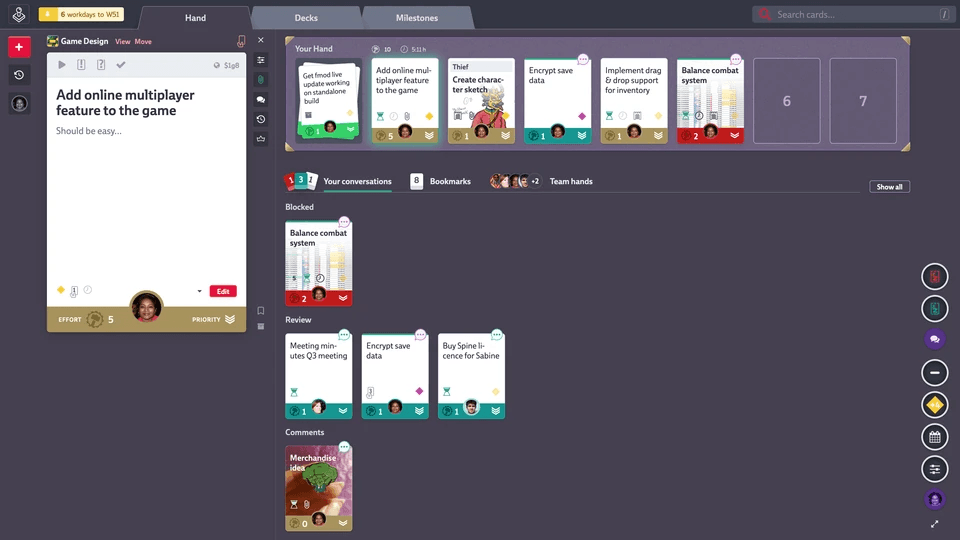

Codecks Unity Bugs & Feedback Reporter
======================================

Thanks for downloading our plugin. The plugin allows you to collect bug and feedback reports right from a easy-to-use form within your game. You can track all the received information using our Codecks platform.

Users also have the option to leave their email which you can use to send them follow-up questions. They will also automatically be notified via e-mail when their card is set to done in Codecks, showing them that they’re feedback is actually being processed and potentially motivating them to return to your game and leave even more feedback. It’s a win-win situation!

Unity Plugin
============

After importing the plugin you will find the plugin in the folder `Assets/Codecks_io/Codecks Bugs & Feedback Reporter`. You can find a scene named `CodecksSampleScene` that contains a default layout and sample setup for you to check out.

The sample scene already provides all the UI elements and component setup for you to get started right away. You can test the initial setup of the report tool right from the sample scene by entering your created report token (the one that you created in your Codecks User Report settings screen) into the Default Token property of the `CodecksCardCreator` component on the `CardCreator` scene object (found under the Canvas object). Once you’ve done that you can hit Play. Click the “Give Feedback!” button, fill out the form and press “Send report”. If everything works you should see a card pop-up in your Codecks just moments later. In case of issues, an error message should be printed to your screen and console.

After testing the initial setup, we recommend copying or integrating the sample scene into your own UI game scene, where you can hook it to show up when pressing a hotkey or by selecting a menu entry according to your own needs. You may also modify the layout to fit your game thematically or use the Codecks default layout as provided. In any case please make sure to not hide the Powered by Codecks sprite and display it next to the report form.

Here’s an explanation what the two provided `MonoBehavior` classes do:

* `CodecksCardCreator` handles the basic API communication with Codecks for the purpose of creating cards inside your Codecks project. This class does not handle any UI related tasks and contains only the basic functionality.
* `CodecksCardCreatorForm` is a helper class that manages the UI and forwards the input to the `CodecksCardCreator` class. You may write your own UI handling in case you’re not using the default Unity Canvas system or in case you have special requirements for your UI. The class provides a method `GetMetaText` which you can edit to add your own game related meta data. By default the component also creates a screenshot and attaches it to the request sent to the `CodecksCardCreator` class. You may choose to add additional files to the request (e.g. attaching a savegame or world state dump).

If you want to generate a new token for each build you distribute, you can integrate the `CodecksTokenCreator` class into your build scripts. Simply call `CodecksTokenCreator.CreateAndSetNewToken` and wait for the callback before your call to `BuildPipeline.BuildPlayer`. This will request a token and store it in your build (in the Resources folder). The `CodecksCardCreator` will check for this created token on startup and use it instead of the default token if present.

Alternatively, call `CodecksTokenCreator.CreateNewToken` to just get a new token and do what you want with it!

Note that because of how unity hands http requests async, your batchmode scripts will need to run without `-quit` in the commandline, and instead need to call `EditorApplication.Exit` manually.

User Reports
============

User Reports allow your users to send feedback directly from within your application. Each feedback will result in a new Codecks card in the deck(s) of your choice. You can use either directly talk to our API endpoint or use our ready-made Unity integration to talk to our Codecks server.

Set up your first application
-----------------------------

As a first step you need to open up your Organization Settings and look for the User Report section. You’ll get to chose between the Unity integration and creating reports via the API. Changes in either section will be reflected in the other (i.e. keys created in the via API section can be used in the Unity integration and vice versa).

Whichever option you’ve picked, you will be asked to add your first application. You need to enter the name and the target deck in which cards shall be added by default. Both options can be changed later on. Once submitted you’ll receive two keys: a Report Tokenand an Access Key. Let’s have a look at those two.

### Report Token

Report Tokens are meant to be embedded within your application. They allow you to create a card according to the options passed to the endpoint and according to the rules you’ve set up in the settings. Report Tokens can be disabled to prevent more reports from coming in. This can be helpful if one token has gone “rogue”. You can re-enable a disabled token anytime.

A application can have multiple Report Tokens, each with a unique label. This is meant to differentiate feedback coming from different builds.

By default Codecks creates a Report Token with a Defaultlabel for you. To create new Report Tokens you need to use another API endpoint along with an Access Key.

### Access Key

Access Keys are more security sensitive and should not end up in your builds. They are meant to be used within your build process though. Whenever you are about to release a new version, you can use the Access Key to create a new Report Token with a version-specific label. The label will be used as a tag in generated cards and thus allows you to quickly filter and sort your reports.

An Access Key is automatically generated when adding a new application in the settings. You won’t be able to see that key again within Codecks. In case you have lost it, you are able to regenerate a new one. This will invalidate the old Access Key however.

Codecks Settings
----------------

Here's a tour of all options available in the settings screen:

- **Report Tokens**

  This tab presents you an overview of all created Report Tokens for your application. It allows you to disable or re-enable specific tokens. Disabling a Report Token will prevent any feedback using this token from creating a card. This list also shows the token itself, label, creation date and the number of created cards.

- **Update Settings**

  This screens allows you to change these settings:

  - **Name of Application:** The name is used in the select box on the top right as well as in emails sent to feedback reporters (see below)
  - **Maximum Upload Size:** As Report Tokens are part of your builds they can theoretically be extracted and used for malicious activites. To prevent user reports from quickly filling up your storage quota, you can configure a limit here.
  - **Map Severity to Deck:** feedback reports can set a **severity** value. Each severity can be mapped to a different deck allowing e.g more severe issues to be put into a dedicated deck.
  - **Map Severity to Priority:** You can also use priority as a signal for severity.

- **New Access Key**

  In case you either lost your current Access Key or you want to invalidate it, this section allows you to create a new Access Key. Make sure to copy it somewhere safe as it won't be shown again after it has been generated.

- **Delete Application**

  This tab allows to remove the application from the User Report integration. Any Access Key or Report Token will be deleted and no more emails will be sent out to feedback reporters. Applications calling the endpoint with a deleted token will receive a `401 unauthorized` response.

### Multi-Application support

In case you're working on multiple games or apps, you can add another application to this integration. Look for the `+` icon next to the application selector in the top right of the settings screen.

Automatic email updates to feedback reporters
---------------------------------------------

When submitting feedback to Codecks, you can provide an optional `userEmail` field. This field will be used to send an email to the provided address once the associated card is set to done. Theses types of email will be sent once a day and batch all done cards for any given email address. The email will contain the name of the application as well as the current card title and a link to it. The link of the card is a smart link and has three modes:

- if the current user is a member of the organization, the smart link will open the card within the organization
- if the card is within a public open deck, the card will be opened in this context
- if neither is true, the link will render a card which only displays the title of the card.

API
---

In case you want to setup your own engine integration or want to understand how the Unity plugin works exactly, we will describe how the API endpoints work exactly:

### Create a report

To create a card issue a `POST` message in the following form:

`POST https://api.codecks.io/user-report/v1/create-report?token=[REPORT_TOKEN]`

#### Body

The body of the message has to be a JSON object of this form:

    {
      "content": "text content of your report\n\nthe first line will be treated as the title.",
      "severity": "high",
      "fileNames": [
        "logs.txt",
        "screenshot-1.png"
      ],
      "userEmail": "user@example.com"
    }

Note that `severity`, `fileNames`, `userEmail` are optional. `severity` can be either `"critical"`, `"high"`, `"low"` or `null`. If a `userEmail` is provided, that user will receive an email once their report is marked as done.

#### Curl example

Here is an example of how to issue the message via `curl`:

    curl 'https://api.codecks.io/user-report/v1/create-report?token=[REPORT_TOKEN]' \
      -H 'Content-Type: application/json' \
      --data-binary '{"content":"report content", "fileNames": ["logs.txt"]}'

#### Response

The response object for this endpoint has this form:

    {
      "ok": true,
      "cardId": "[CARD_ID]",
      "uploadUrls": [
        {
          "fileName": "logs.txt",
          "url": "https://[UPLOAD_URL]",
          "fields": {
            "key1": "[VALUE1]",
            "key2": "[VALUE2]"
          }
        },
        {
          "fileName": "screenshot-1.png",
          "url": "https://[UPLOAD_URL]",
          "fields": {
            "key1": "[VALUE1]",
            "key2": "[VALUE2]"
          }
        }
      ]
    }

#### Uploading files

You'll receive an entry in the `uploadUrls` list for each file name you specified in `fileNames`. This contains a signed URL that allows you to directly upload the files to the respective Codecks S3 bucket.

This means we're relying on [AWS Api](https://docs.aws.amazon.com/AmazonS3/latest/API/sigv4-HTTPPOSTConstructPolicy.html) here which unfortunately is a bit more involved.

For each file you need to create a `POST` request to the specified `url`. The payload is _not_ JSON-based but is `multipart/form-data` encoded. We strongly encourage you to use a http library of your choice to construct the request. The `FormData` contains all the listed `fields` as well as an additional field called `file` containing the binary contents of your file and another field `Content-Type` containing the mime-type of the file (e.g. `text/plain` or `image/png`).

### Create a new Report Token

To create a new report token issue a `POST` of this form:

`POST https://api.codecks.io/user-report/v1/create-report-token?accessKey=[ACCESS_KEY]`

#### Body

The body of the message has to be a JSON object of this shape:

    {
      "label": "string describing your version"
    }

#### Curl example

Here is a `curl` example using this endpoint:

    curl 'https://api.codecks.io/user-report/v1/create-report-token?accessKey=[ACCESS_KEY]' \
      -H 'Content-Type: application/json' \
      --data-binary '{"label":"v0.2.1"}'

#### Response

The response is expected to be of this form:

    {
      "ok": true,
      "token": "[TOKEN]"
    }
